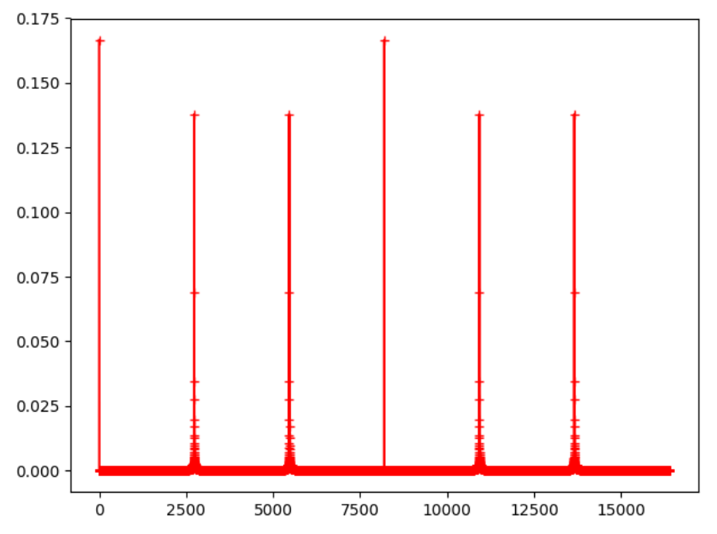

# quantum-computing

<h2>Shor's Algorithm</h2>

 
  <a href = "https://github.com/mhasan08/quantum-computing/blob/master/Shor.py">shor.py</a> contains code that simulates Shor's algorithm for factoring a given integer into its prime factors. Following image shows dft plot for factoring 91. 
    
  

